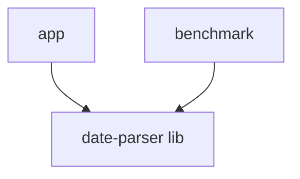

# Date and Time parsing in Android

Benchmark project for date and time parsing in Android.
Used to compare different libraries and methods for parsing date and time strings.

- SimpleDateFormat
- LocalDateTime
- Instant

## Project Structure

## Results

For more accurate results, run the tests on different devices.

## Naive benchmarks - Using Unit Test

| Library          | Time (ms)  |
|------------------|------------|
| SimpleDateFormat | 242.578041 |
| LocalDateTime    | 200.570792 |
| Instant          | 361.839208 |

## Benchmarks - Using Microbenchmark library

| Library          | Time (ns)     |
|------------------|---------------|
| SimpleDateFormat | 1,199,443,376 |
| LocalDateTime    | 365,684,542   |
| Instant          | 585,845,375   |
